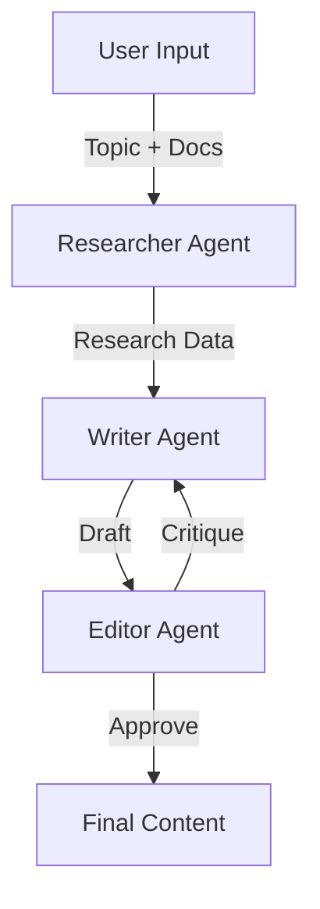

# 🤖 Collaborative Content Synthesis Engine

> **A Multi-Agent AI System for High-Quality Content Generation.**
> *Powered by LangGraph, LangChain, and Streamlit.*

## 📖 About
Standard AI content generation often lacks depth, accuracy, and nuance. The **Collaborative Content Synthesis Engine** solves the "quality-consistency gap" by simulating a professional editorial team. 

Instead of a single zero-shot prompt, this system orchestrates a team of specialized agents:
- **🕵️ Researcher**: Scours the web for real-time data, facts, and diverse perspectives using Tavily.
- **✍️ Writer**: Drafts comprehensive articles grounded in research and optional user-provided documents (RAG).
- **🧐 Editor**: Critiques the work for flow, tone, and accuracy, requesting revisions until the quality meets the standard.

## ✨ Key Features
- **Multi-Agent Orchestration**: Hierarchical state management using [LangGraph](https://langchain-ai.github.io/langgraph/).
- **Real-Time Research**: Integrated with **Tavily API** for up-to-date sources.
- **RAG (Retrieval-Augmented Generation)**: Upload your own knowledge base (.txt/.md) to steer the content.
- **Human-in-the-Loop UI**: Interactive **Streamlit** dashboard to visualize the workflow and Reviewer feedback.
- **Iterative Refinement**: Automatic feedback loops between Editor and Writer agents.

## 🏗️ Architecture



## 🚀 Getting Started

### Prerequisites
- Python 3.10+
- OpenAI API Key
- Tavily API Key

### Installation

1.  **Clone the repository**
    ```bash
    git clone https://github.com/yourusername/content-synthesis-engine.git
    cd content-synthesis-engine
    ```

2.  **Install dependencies**
    ```bash
    pip install -r requirements.txt
    ```

3.  **Environment Setup**
    Create a `.env` file in the root directory:
    ```bash
    cp .env.example .env
    ```
    Add your keys:
    ```env
    OPENAI_API_KEY=sk-...
    TAVILY_API_KEY=tvly-...
    ```

### Usage

Run the Streamlit application:
```bash
streamlit run app.py
```
Open your browser to `http://localhost:8501`.

## 🐳 Docker Support

To run via Docker:
```bash
docker build -t content-engine .
docker run -p 8501:8501 -e OPENAI_API_KEY="your-key" -e TAVILY_API_KEY="your-key" content-engine
```

## 🛠️ Stack
- **Framework**: LangChain, LangGraph
- **LLM**: GPT-4o (Configurable)
- **Search**: Tavily Search API
- **Vector Store**: ChromaDB
- **Frontend**: Streamlit

## 🤝 Contributing
Contributions are welcome! Please open an issue or submit a PR.

## 📄 License
MIT License.
